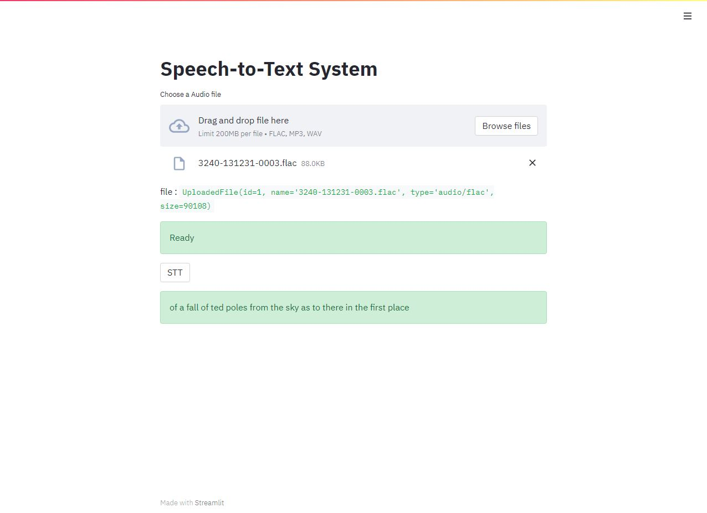

# TensorflowASR Conformer Model Tester

##### https://github.com/TensorSpeech/TensorFlowASR 해당 링크의 코드를 활용하였습니다.

#### < Conda env Setting >
<pre>
conda create -n ASR python==3.8.8
conda activate ASR
pip install -U TensorFlowASR[tf2.4-gpu]
</pre>

#### < Run >
<pre>
streamlit run STT_System.py
</pre>

#### < Result >

